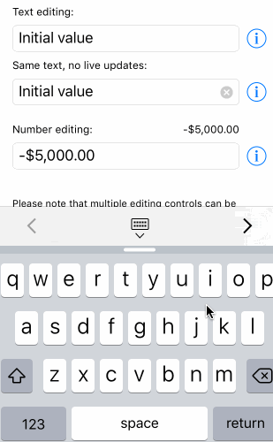
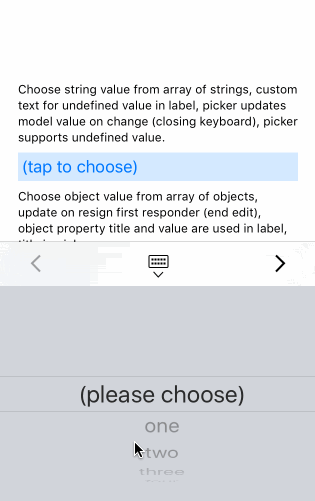

## Moving on

I am not going to maintain this project anymore because it doesn't fit well into the Swift landscape and Swift is taking over the iOS community much faster than I have anticipated.

Swift-UI makes this approach obsolete. 

# Data Binding for iOS

AKA Beacon is a data binding framework for iOS designed for Interface Builder.

* [What is Data Binding](https://github.com/mutech/aka-ios-beacon/wiki/What-is-Data-Binding)
* [About View Models](https://github.com/mutech/aka-ios-beacon/wiki/About-View-Models)
* [What are the advantages of using Data Binding](https://github.com/mutech/aka-ios-beacon/wiki/What-are-the-advantages-of-using-Data-Binding)
* [How is Beacon different from Data Binding on OS X](https://github.com/mutech/aka-ios-beacon/wiki/How-is-Beacon-different-from-Data-Binding-on-OS-X)
* [How does Beacon relate to other binding frameworks](https://github.com/mutech/aka-ios-beacon/wiki/How-does-Beacon-relate-to-other-binding-frameworks)

## News

**Version 0.3.1**

* Fixes related to Cocoapods 1.0, pod try
* Fixes in Demo App

**Version 0.3**

* Removed dependencies to AKACommons (merged) and CocoaLumberjack (temporarily until modular podspec is done).
* Support for conditional binding expressions ($when, $whenNot, $else)
* Refactored UITableView data source binding to use conditionals in cell mappings

## Contents

- [Installation & Integration](#installation-&-integration)
- [License](#license) (BSD 2-clause license)
- [Getting Started](#getting-started)
- [Documentation](#documentation)
- [How Beacon works](#how-beacon-works)
- [Examples](#examples)
  - [Text Field Binding Example](#text-field-binding-example)
  - [Picker Keyboards](#picker-keyboards)
  - [Label Binding Demo](#label-binding-demo)

## Installation and Integration

Beacon is available on CocoaPods. 

To integrate AKABeacon, enable ```use_frameworks!``` in your Podfile and add the dependency to AKABeacon:

```
use_frameworks!
...
pod 'AKABeacon', '~> 0.3'
```

If you are using the [CocoaPods try plugin](https://github.com/CocoaPods/cocoapods-try), an easy way to start experimenting with Beacon is:

```
$ pod try AKABeacon
```

## License

BSD 2-clause, see LICENSE.txt

## Getting Started

Once you integrated the framework into your project, all you have to do to use bindings is:

### In Interface Builder

  - **Design your view hierarchies in Storyboards** or NIB files the same way you did before.
  - **Define** [binding expressions](https://github.com/mutech/aka-ios-beacon/wiki/Supported-Bindings-and-Binding-Types) **in the property inspector for your views**. For example, to bind a text field or label text to a property ```myTextProperty```, simply set the "Text Binding" property to ```myTextProperty```.

### In Code

  - [Enable binding support](https://github.com/mutech/aka-ios-beacon/wiki/How-To-Enable-Binding-Support) in your view controller. To do that, add ```[AKABindingBehavior addToViewController:self]``` to your ViewController's ```viewDidLoad``` method (You need to ```@import AKABeacon;```).
  - Your view controller is (by default) used as root view model, so it has to **provide the properties for key paths you use in your binding expressions**. For the example above, the binding would expect the view controller to implement a key value coding-compliant property ```myTextProperty```.

The demo project contains a lot of examples for different binding types.


## Documentation

* [Beacon's Github Wiki](https://github.com/mutech/aka-ios-beacon/wiki)
* The [API documentation](http://cocoadocs.org/docsets/AKABeacon) is still not in a usable state, mainly because the code base is not yet sufficiently stable. Stay tuned.
* The most up to date information is [available here](https://github.com/mutech/aka-ios-beacon/tree/master/AKABeacon/AKABeacon/Classes) (, Luke)

## How Beacon works

The typical usage scenario is (what you do - that's the yellow bubbles in the diagram below):

* You **add the beacon framework to your project**. From then on, you will find additional properties for views and view controllers in Interface Builder's property panel.
* You **enable binding support** for your view controller, which is implemented by adding a binding behavior as child view controller.
* Your view controller **provides** properties or a reference to your **model data**
* You design a view in Interface Builder and **assign binding expressions** to views which should be bound to your data.

What happens behind the scenes (Beacon's job, everything that's blue in the diagram):

* When you enable binding support, beacon adds a binding behavior as child view controller to yours. This behavior receives life cycle events along with your own controller:
  * **viewDidLoad:** The binding behavior will **inspect your view hierarchy** to find views defining binding expressions and **create bindings** for them.
  * **viewWillAppear:** The bindings will **initialize views** with content from your view model **observe changes** on boths ends and **perform the necessary updates**.
  * **viewWillDisappear:** Bindings will **stop observing changes**.


Many of these tasks are actually carried out by **controls** which are in charge of managing bindings, providing data contexts and controlling the behavior of view hierarchies. In most cases you can ignore controls, since they do their job transparently without bothering you. If you need to interact with them however, they provide fine granular delegate methods, which you can use to inspect and control the behavior of controls and bindings. Your view controller is automatically used as AKABindingBehaviorDelegate if you conform to that protocol. 

Please note that most modules in Beacon are designed to be independent. You can for example use bindings without controls, and you don't have to use form view controllers to manage controls and bindings.

We spend a lot of effort to ensure that you can use the parts of the framework that actually help you without requiring you to put your architecture upside down just to integrate data binding functionality.

We also tried hard to take over all the work to support standard use cases such that you don't have to write code, just to make sure that your text fields are visible when you're typing, that it still works when you rotate the device. This is going much further than scrolling. In later versions you will get automatic support for theming, automatic font resizing, highlighting of search terms, form transaction support (model values are updated at the end of a form editing session and only if valid) and much more.

## Examples

**Note:** The examples here are aging, take a look at the demo application for up to date impressions.

### Example 1: Text Field Binding Example

The following screen shot shows a view with three text fields. The first two are bound to a property ```stringValue```, the first text field will update the data source after each key stroke, the second when the text field will lose keyboard focus.

The third text field is bound to a number value and demonstrates different editing and display number formatters.

#### First Text Field Binding Expression

```
stringValue {
	textForUndefinedValue: "(Please enter some text)",
	treatEmptyTextAsUndefined: $true
}
```

#### Second Text Field Binding Expression

```
stringValue { liveModelUpdates: $false }
```

#### Third Text Field Binding Expression

```
numberValue {
	numberFormatter: {
		numberStyle: $enum.CurrencyStyle
	},
	editingNumberFormatter: {
		maximumFractionDigits: 5
	}
}
```

#### View Controller

* [TextFieldBindingViewController.h](https://github.com/mutech/aka-ios-beacon/blob/master/AKABeaconDemo/AKABeaconDemo/TextFieldBindingViewController.h) and
* [TextFieldBindingViewController.h](https://github.com/mutech/aka-ios-beacon/blob/master/AKABeaconDemo/AKABeaconDemo/TextFieldBindingViewController.m)

#### Screenshot




### Example 2: Picker Keyboards

Picker keyboard trigger views wrap content and react to a tap gesture by opening up a keyboard containing a picker view. This example shows two such trigger views. The first is set up to choose a string from an array of strings and contains a label that is bound to the selected value. The second trigger view selects an object from an array of objects (displaying the title property as choice title).

The binding expressions used here are:

#### First Picker Binding Expression
Label: (connects the label to key path `stringValue` and configures the binding to display "(tap to choose)" if the value is undefined).

```
stringValue {
	textForUndefinedValue: "(tap to choose)"
}
```

Picker: (the picker keyboard takes its choices from `stringArrayValue`. Since no title is specified, array items will be used as values for respective choices).

```
stringValue {
	choices: stringArrayValue,
	titleForUndefinedValue: "(please choose)"
}
```

#### Second Picker and Labels Binding Expression

Labels: (This picker contains multiple labels bound to different properties of the data context, which is an object in this case).

```
objectValue.title
```

```
objectValue.value
```

Picker: (Here, the array items are complex objects, so the title attribute is defined as key path relative to the respective array item; picker keyboards also support the setting liveModelUpdates).

```
objectValue {
	title: title,
	choices: objectArrayValue,
	liveModelUpdates: $false
}
```

#### Date Picker Binding Expression

Date picker label: (See the section on label formatting).

```
dateValue { dateFormatter: { dateStyle: $enum.LongStyle, timeStyle: $enum.MediumStyle } } 
```

Picker: (The date picker only needs the key path for the selected value).

```
dateValue
```

#### View Controller

* [PickerKeyboardViewController.h](https://github.com/mutech/aka-ios-beacon/blob/master/AKABeaconDemo/AKABeaconDemo/PickerKeyboardViewController.h) and
* [PickerKeyboardViewController.m](https://github.com/mutech/aka-ios-beacon/blob/master/AKABeaconDemo/AKABeaconDemo/PickerKeyboardViewController.m)

#### Screenshot




### Example 3: Label Binding Demo

The following examples demonstrate the built-in formatting capabilities of Beacon. Beacon uses NSFormatter as interface for formatting and NSNumberFormatter and NSDateFormatter for numbers and dates respectively. You can define custom formatters other types.

#### Numbers:
The **numberFormatter** attribute supports most configuration properties of NSNumberFormatter. Enumeration values can be specified as `$enum.Value` (if the enumeration is known to Beacon) or `$enum.Type.Value` (you can provide mappings for your own enumerations).

```
floatValue {
	numberFormatter: {
		numberStyle: $enum.CurrencyStyle
	}
}
```

#### Boolean values:

**textForYes** and **textForNo** allow you to map number values to title.

```
boolValue {
	textForYes: "Yes",
	textForNo: "No"
}
```

#### Text values:

If you don't need any formatting, just specifying the key path to the value is enough.

```
textValue
```

#### Complex values and custom formatters:

You can use your own formatters by specifying the class name in angle brackets. You are however restricted by the data types that can be represented as binding expressions for the configuration of your custom formatter. As mentioned above, enumerations values can be registered:

```
objectValue {
	formatter: <CustomFormatter> {
		format: "Hello, %@"
	}
}
```

We're planning to support templating libraries such as mustache or handlebars. Once implemented a similar example would look like:

```
objectValue {
	formatter: <MustacheFormatter> {
		template: "Hello, {{givenName}} {{familyName}}"
	}
}
```

#### Date values:

Similar to number values, date values can be formatter using the NSDateFormatter.

```
dateValue {
	dateFormatter: {
		dateStyle: $enum.NSDateFormatterStyle.LongStyle,
		timeStyle: $enum.LongStyle
	}
}
```

#### View Controller

* [LabelDemoTableViewController.h](https://github.com/mutech/aka-ios-beacon/blob/master/AKABeaconDemo/AKABeaconDemo/LabelDemoTableViewController.h) and
* [LabelDemoTableViewController.m](https://github.com/mutech/aka-ios-beacon/blob/master/AKABeaconDemo/AKABeaconDemo/LabelDemoTableViewController.m)

#### Screenshot


